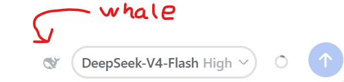

# dsh-provider-badge



DSH 静态客户端插件：在输入框模型选择器旁显示当前 provider 图标。

- **DeepSeek**（provider 名含 `deepseek`）→ 鲸鱼 SVG
- **OpenCode Go**（provider 名含 `opencode`，如 `opencode-go`；或为 `go`）→ 加粗连笔 "GO" 字标
- **OpenCode Zen**（provider 名恰好为 `opencode`，或含 `zen`）→ 加粗连笔 "ZEN" 字标
- **其他 provider** → 点阵首字母

图标订阅了“模型选择插件”自己的 per-session store（`modelDirectories`），切模型即时更新；并按 composer 工具行高度等比自适应（DPI/缩放与行高变化都会跟随）。

## 安装

GitHub 安装：

```bash
dsh plugin --profile <profile 名> add github:marshfolx/dsh-provider-badge#main
```

该命令会把插件写入 profile 的 `package.json`（dependencies 与 `dsh.profile.bundles`）并完成安装，重启 DSH 后生效。

手动方式等价：在 profile 的 `package.json` 里添加

```json
"dependencies": {
  "dsh-provider-badge": "github:marshfolx/dsh-provider-badge#main"
}
```

并把 `"dsh-provider-badge"` 追加到 `dsh.profile.bundles`，然后在 profile 目录执行 `pnpm install`，重启 DSH。

## 微调（改完刷新页面即可，不实时也没关系）

**永久修改**：编辑 `client/client.js` 顶部的 `TUNING_DEFAULTS`：

| 键 | 默认 | 含义 |
| --- | --- | --- |
| `iconScale` | `1` | 图标高度倍率（鲸鱼 13px、字母 10px 都乘它） |
| `yOffset` | `0` | 垂直偏移 px，正数向下 |
| `color` | `'var(--dsw-alias-label-caption)'` | 图标颜色，默认跟随主题的说明文字色（与思考等级 Max/High 同色，深浅主题自动适配）。想半透明可用 `rgba(...)`，或 `color-mix(in srgb, var(--dsw-alias-label-caption) 70%, transparent)` |

**临时实验（不改文件）**：浏览器 DevTools console 执行：

```js
localStorage.setItem('dsh-provider-badge:tuning', JSON.stringify({ iconScale: 1.1, yOffset: -1 }));
location.reload();
```

清空实验值：

```js
localStorage.removeItem('dsh-provider-badge:tuning');
location.reload();
```

修改 `client/client.js` 后刷新页面；若浏览器缓存了旧 bundle，硬刷新（Ctrl+F5）或重启 DSH。

## 结构

- `cordis.patch.yml` — 组合插入行（`provider-badge`）
- `dsh.plugin.json` — 插件元数据清单
- `lib/index.js` — host half（空实现，本插件纯客户端）
- `client/client.js` — 浏览器half（`window.__ModuleLoader__.load` 注册，零构建、零依赖）
