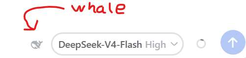

# dsh-provider-badge



DSH 纯客户端插件：在输入框模型选择器旁显示当前 provider 图标。

- **DeepSeek**（provider 名含 `deepseek`）→ 鲸鱼 SVG
- **OpenCode Go**（provider 名含 `opencode`，如 `opencode-go`；或为 `go`）→ 加粗连笔 "GO" 字标
- **OpenCode Zen**（provider 名恰好为 `opencode`，或含 `zen`）→ 加粗连笔 "ZEN" 字标
- **其他 provider** → 点阵首字母

图标订阅了“模型选择插件”自己的 per-session store（`modelDirectories`），切模型即时更新；并按 composer 工具行高度等比自适应（DPI/缩放与行高变化都会跟随）。

## 运行要求

在 DSH `0.2.0-rc.2` 上验证通过。本包是一个 `dsh.client` bundle：host half 为空，浏览器 half 通过 `window.__ModuleLoader__.load` 注册，因此不需要构建步骤。它不声明任何 npm 依赖 —— React 来自 Web 端平台模块表，两个浏览器侧依赖写在 `dsh.client.inject` 里：

| 条目 | 作用 |
| --- | --- |
| `@deepseek-ai/dsh-client-ui-conversation` | 声明了 `conversation.input.right`，即徽章所占据的 slot |
| `@deepseek-ai/dsh-client-ui-model-selection` | 提供徽章所读取的 `modelDirectories` 服务 |

DSH 自带包从 DSH 安装目录解析，所以这两者都不出现在 `dependencies` 或 `peerDependencies` 里。

## 安装

本地检出安装：用 `plugin_manager` 的 `action: install_bundle`，`target` 传包的绝对路径。它会把依赖和 `dsh.profile.bundles` 条目写进 profile 并完成安装，之后重启 DSH。

同一个包也可以用 Plugin Manager「Add plugin」对话框接受的标识安装 —— 包名、Git 地址、tarball 或本地绝对路径：

```bash
dsh plugin add github:marshfolx/dsh-provider-badge#main
```

## 插件元数据

DSH 会**在不激活插件的前提下**从清单里读取 Plugin Manager 卡片文案与图标：

- `package.json` 的 `icon` → `./icon.svg`（SVG/PNG/JPEG/WebP，≤256 KiB，须位于包目录内）
- `locale/en.json`、`locale/zh.json` → `meta.title` 与 `meta.description`，通过导出的 `./locale/*.json` 子路径提供

字段缺失时回退到 `package.json` 的 `name` 和 `description`。

## 微调（改完刷新页面即可）

**永久修改**：编辑 `client/client.js` 顶部的 `TUNING_DEFAULTS`：

| 键 | 默认 | 含义 |
| --- | --- | --- |
| `iconScale` | `1.2` | 图标高度倍率（鲸鱼 13px、字母 10px 都乘它） |
| `yOffset` | `1` | 垂直偏移 px，正数向下 |
| `color` | `'var(--dsw-alias-label-caption)'` | 图标颜色，默认跟随主题的说明文字色（与思考等级 Max/High 同色，深浅主题自动适配）。想半透明可用 `rgba(...)`，或 `color-mix(in srgb, var(--dsw-alias-label-caption) 70%, transparent)` |

**临时实验（不改文件）**：浏览器 DevTools console 执行：

```js
localStorage.setItem('dsh-provider-badge:tuning', JSON.stringify({ iconScale: 1.1, yOffset: -1 }));
location.reload();
```

清空实验值：

```js
localStorage.removeItem('dsh-provider-badge:tuning');
location.reload();
```

## 更新已安装的副本

浏览器 half 由客户端模块系统提供，**支持热重载**：已安装的 `client.js` 一旦变化，已经打开的页面会直接换掉插件，无需刷新（已实测 —— 改动 slot 的 `order` 后在同一个页面里立即生效）。

`package.json` 元数据在激活时读取并在重启前缓存，所以改动 `dsh.client.inject`、`dsh.client.immediately`、图标或 locale 文件需要重启 DSH。

pnpm 对 `file:` 依赖使用**硬链接**，因此就地写入工作区文件会同时改动已安装副本；而「先写新文件再改名」式的编辑器会打断这个链接、让已安装副本变成旧内容 —— 拿不准时重新安装或重启即可。

## 校验

```bash
npm test
```

两个零依赖探针。`test/manifest-probe.mjs` 按 DSH 对 `dsh.client` bundle 的安装契约复查本包（清单字段、`./client` 导出、bundle 注册 id、locale/icon 元数据、依赖卫生）；`test/client-probe.mjs` 用桩服务真实执行 `client/client.js`，断言各 provider 下徽章渲染出的内容。两者编码的都是 `0.2.0-rc.2` 的契约，升级 DSH 后请先重读它们头部列出的对应包，再相信绿灯。

## 结构

- `cordis.patch.yml` — 组合插入行（`provider-badge`）
- `package.json` — bundle 清单：`dsh.bundle.patch`、`dsh.client`、`icon`、locale 导出
- `icon.svg` — Plugin Manager 图标
- `locale/en.json`、`locale/zh.json` — Plugin Manager 标题与描述
- `lib/index.js` — host half（`export function apply() {}`，本插件纯客户端）
- `client/client.js` — 浏览器 half（`window.__ModuleLoader__.load` 注册，零构建、零依赖）
- `test/manifest-probe.mjs`、`test/client-probe.mjs` — `npm test` 运行的校验
